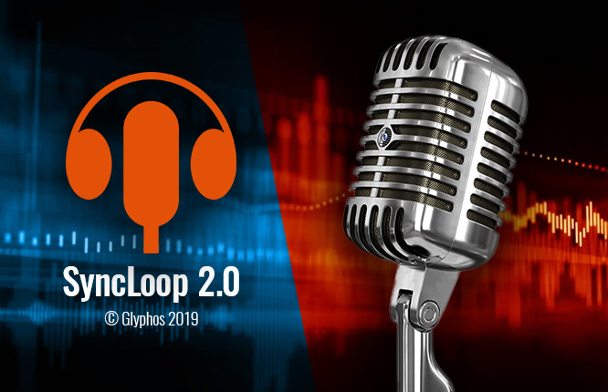

# SyncLoop
## Dubbing and subtitling application

 This is an application I created for personal use. I was working as a translator for cable channels TV shows and needed a way to sync the dialog loops to the translated content. It was my first (and so far only!) incursion in the realm of C#; a programming language I got to really like.  
 It's not by any means a polished application. Since it was for personal use only, I kept postergating some bug fixes and polishing that needs to be done.
 Anyway, the goal now is to port this to Electron (Node) to be able to run it anywhere.

## Features
- Sync loops for dubbing and subtitling.
- Create and edit characters.
- Generate proof-read document.
- Generate final files in Excel, RTF or DUB formats.
- Create and edit series.
- Create and edit channels.
- Offset loops.
- Check for loop overlapping.
- Set and check subtitles max length.
- Set and recall frequently used text with function keys.
- Set and edit current rates.
- Create pay periods.
- Automatically generate work reporst per period (Excel).
- Automatically generate invoice files for printing (SVG).
- Modifiable invoice template (SVG).

